# Create Virtual machine only — UX documentation

### Contact: Yifat Friman Menchik, UXD

## Goal

Document the Create Virtual machine flow. Virtual machines list + create wizard (no VM details drill-in).

**Mock:** `vmaas-create-vm-only.html` (Option 2 IA — no **Configure** nav item)  
**Create VM only:** [https://yfrimanm.github.io/openshift-origin-design/vmaas-create-vm-only.html](https://yfrimanm.github.io/openshift-origin-design/vmaas-create-vm-only.html) — Virtual machines list first. Click Create to open the wizard.  
**Same IA reference:** [https://yfrimanm.github.io/openshift-origin-design/vmaas-create-wizard-option-2.html](https://yfrimanm.github.io/openshift-origin-design/vmaas-create-wizard-option-2.html)  
**Google Doc:** [Create Virtual machine only — UX documentation](https://docs.google.com/document/d/1LL0iWhIIh3gAhJAsm7MCpnlFxfzaOXkZS_MVI6dSfSo/edit)  
**Screenshots:** `videos/vmaas-create-vm-only-ux-doc/`  
**Regenerate screenshots:** `node scripts/capture-vmaas-create-vm-only-screenshots.mjs`

Select template → Details → Compute resource → Storage → Network → Review and create

---

## UX summary

| Decision | Detail |
|---|---|
| **Scope** | List + Create wizard only. VM names are not links; no details Overview page. |
| **IA** | Same as Option 2: flat steps — no **Configure** parent in the wizard nav. |
| **Wizard left nav** | PatternFly wizard step nav on the left (always visible in mock). |
| **Role labels** | Masthead role dropdown: **VM Admin**, **VM User**, Console Access Only, Organization Administrator — no vApp aliases. |
| **Search** | Regular search field only (no advanced filters / sliders icon). Attribute filters (Project / Status / OS) remain below. |
| **Row kebab = Actions** | Same items and copy: Control ▸, Open console, Delete. Helper text uses **VM** (not Virtual machine). |
| **OS image** | Shown when selecting the template (and on Review). Not on Details. |
| **Access** | Optional SSH / cloud-init on **Details**. |
| **Locked vs Editable** | Lock / pen icons. Prefer **Locked** / **Editable** (not Flexible / Fixed). |
| **Project** | Editable dropdown on Details; prefills from list context. |
| **Exit confirm** | Warning modal: Exit without saving / Continue creating. |

---

## Entry — Virtual machines list

- Primary **Create** opens the wizard.
- Regular search + Save search / Saved searches.
- Attribute filters: Project, Status, Operating system.
- Toolbar **Actions** disabled until selection; matches row kebab when enabled.

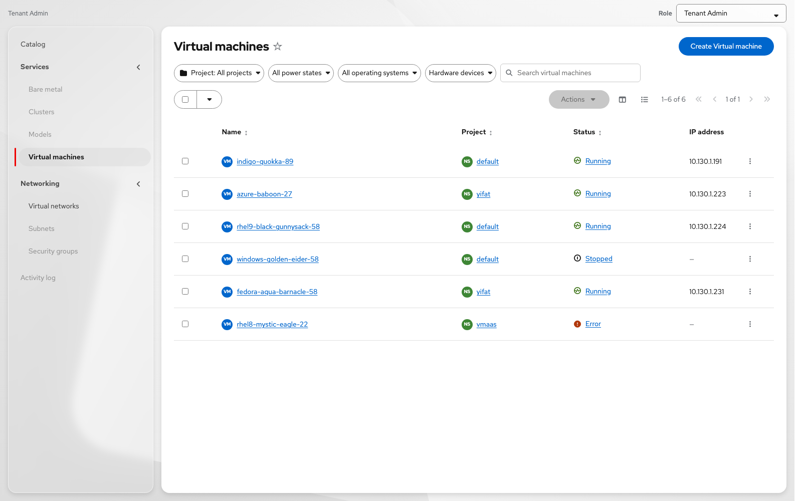

### Row kebab / Actions menu

- **Control** flyout: Start / Stop / Pause / Restart / Reset (state-dependent)
- **Open console** — disabled when not running (*The VM is not running*)
- **Delete** — disabled while running (*The VM is running*)

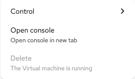

---

## Step 1 — Select template

Browse templates as cards. Selecting a template opens a drawer with **Template settings**:

- **Locked by this template** — OS image always; compute / boot disk when locked  
- **Editable later** — fields the user can change on later steps  

**Editable** templates show starting CPU / memory / storage and pen icons. Locked SKUs show lock icons.

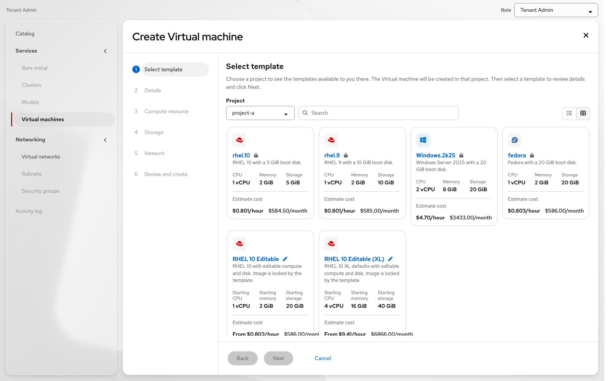

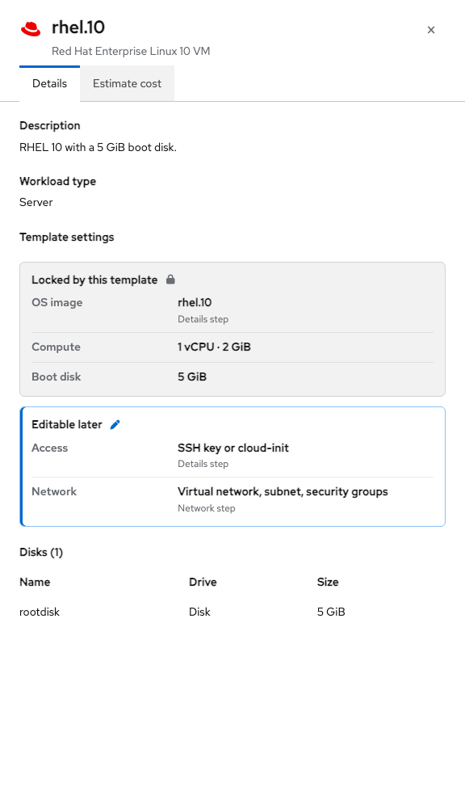

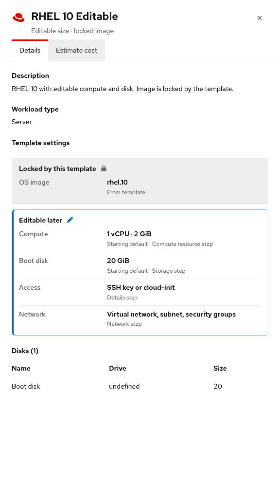

**Dev notes**

- Per-field governance: `compute` / `bootDisk` = `locked` \| `editable`; image always locked.
- Card cost may prefix hourly with **From** when size is editable.

---

## Step 2 — Details

- Step help: *Name your Virtual machine, select a project, and optionally set access.*
- **Name** (required) + generate
- **Description** (optional)
- **Project** — This needs to be set before showing the available templates
- **Access** (Optional) — SSH public key and cloud-init

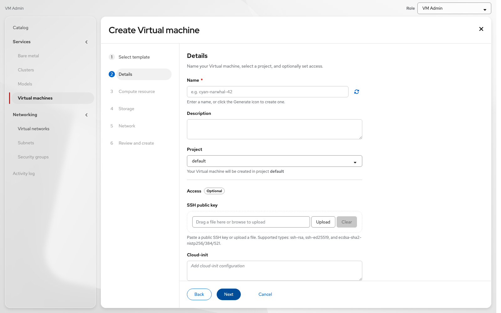

---

## Step 3 — Compute resource

- Compute resource (locked or editable per template)
- Step help when editable: *Choose a compute size.*
- When locked: *Compute size is locked by the template.*
- OS image and Access are not on this step (they are on Details)

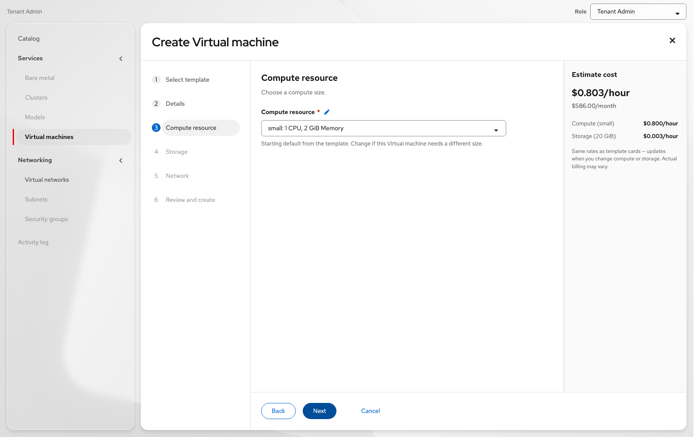

---

## Step 4 — Storage

- Boot disk size (locked or editable)
- **Additional disks** with Add disk; empty state *No additional disks yet.*

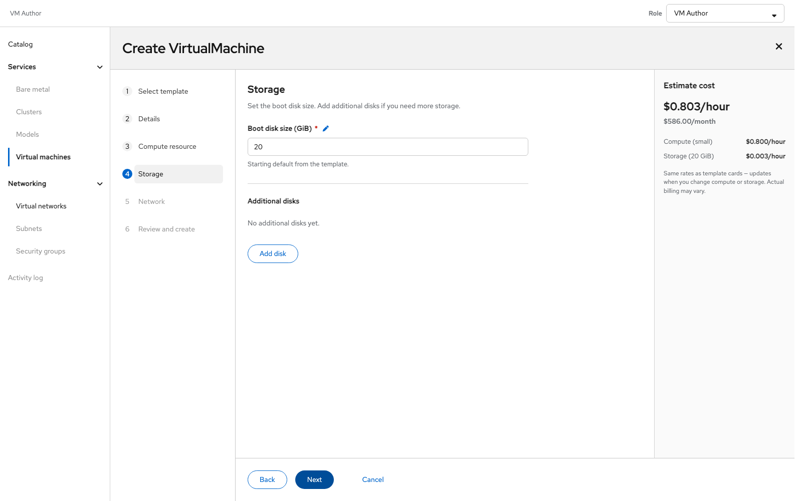

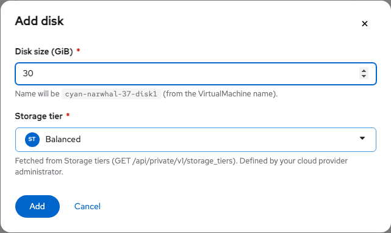

---

## Step 5 — Network

- Virtual network, subnet, security groups (required)
- **Additional networks** with Add network; empty state *No additional networks yet.*

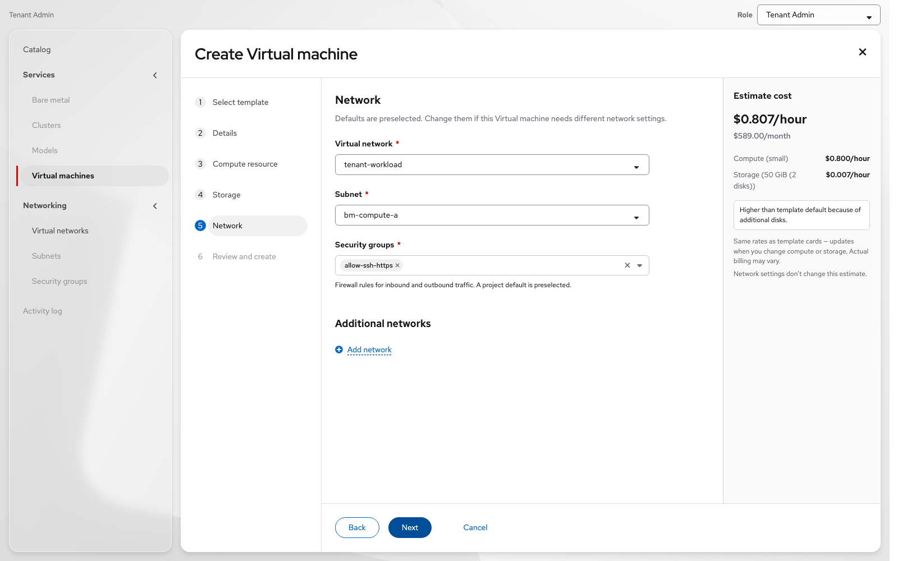

---

## Step 6 — Review and create

Grouped review: Details (includes Access) / Compute resource / Storage / Network with edit links. Cost panel on the right. Optional *Start this Virtual machine after creation*.

- Access: *Configured* / *Not configured* (filename when SSH uploaded)
- Additional disks / networks: *Disk N* / *Network N* or *None*

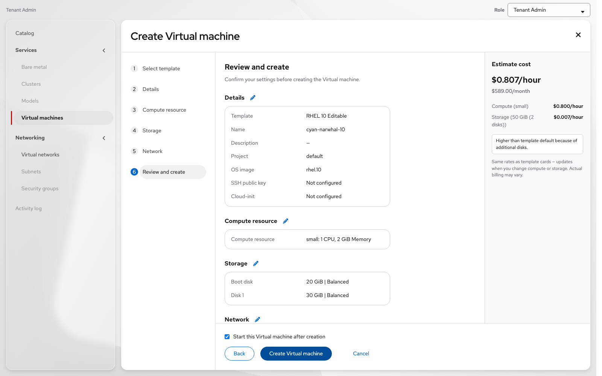

---

## Exit confirmation

| Element | Copy |
|---|---|
| Title | Exit Virtual machine creation? |
| Body | If you leave now, any information you’ve entered won’t be saved. |
| Primary | Exit without saving |
| Secondary | Continue creating |

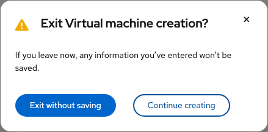
