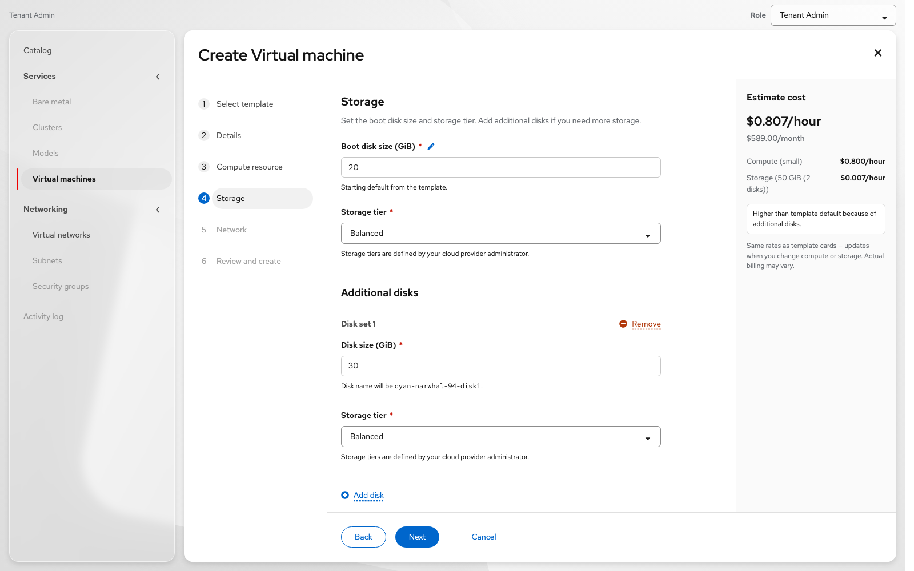
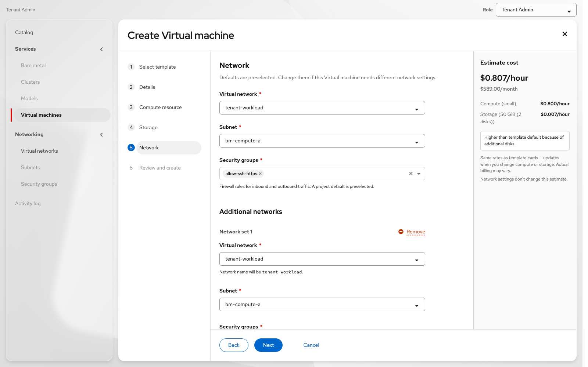

# Create Virtual machine — UX documentation

### Contact: Yifat Friman Menchik, UXD

## Handoff overview

| | |
|---|---|
| **Scope of this doc** | Virtual machines **list** + **Create** wizard |
| **Companion doc** | [Virtual machine details Overview — UX documentation](https://docs.google.com/document/d/1Y8hjgE924owve0VXA3rkKqTYuB4sXKif8KhXyFL3hyQ/edit) |
| **Shared interactive mock** | [vmaas-create-vm-only.html](https://yfrimanm.github.io/openshift-origin-design/vmaas-create-vm-only.html) — one mock covers list → create → details |
| **Google Doc (this doc)** | [Create Virtual machine - UX documentation](https://docs.google.com/document/d/1LL0iWhIIh3gAhJAsm7MCpnlFxfzaOXkZS_MVI6dSfSo/edit) |
| **Screenshots** | `videos/vmaas-create-vm-only-ux-doc/` · [GitHub](https://github.com/yfrimanm/openshift-origin-design/tree/gh-pages/screenshots/create) |
| **Regenerate screenshots** | `node scripts/capture-vmaas-create-vm-only-screenshots.mjs` |

**IA:** Select template → Details → Compute resource → Storage → Network → Review and create

---

## Goal

Document the Create Virtual machine flow for OSAC VMaaS (catalog / template–first). List and create share one mock with VM details Overview; this doc covers **create only**.

---

## UX summary

| Decision | Detail |
|---|---|
| **Scope** | List + Create wizard. VM **Name** links open details Overview (see companion doc). |
| **IA** | Flat wizard steps — no **Configure** parent in the nav. |
| **Primary CTA** | **Create Virtual machine** |
| **Role labels** | **Tenant Admin**, **Tenant User** (OSAC personas). Demo switcher only — gates Create / power / networks. |
| **Tenant Admin** | Create VM, power actions, create/view networks (incl. Shared / Provider). Default for Create demos. |
| **Tenant User** | No Create; power/console on VMs; view networks. |
| **Search** | Regular search + attribute filters (Project / Status / OS). No advanced search icon. |
| **Row kebab / Actions** | Control ▸, Open console, Delete. Disabled reasons use **Virtual machine** wording. |
| **Status** | Status is a link → PF6 popover (title, body, **Ask AI about this status** placeholder, Learn more). |
| **OS image** | On template selection + Review — not on Details. |
| **Access** | Optional SSH / cloud-init on **Details**. |
| **Locked vs Editable** | Template governance: lock / pen. Prefer **Locked** / **Editable**. |
| **Project** | Dropdown on Select template (prefilled from context); also on Details. |
| **Exit confirm** | Exit without saving / Continue creating. |
| **After create** | Opens the new VM details Overview + success toast (`created` or `created and starting` → Running). |
| **Start after create** | Review checkbox **Start this Virtual machine after creation** — checked by default (CNV parity). |
| **Shell chrome** | PatternFly **Felt + Glass** (PF 6.6.1), aligned to Ethan’s [osac-bmaas](https://heyethankim.github.io/osac-bmaas/) — soft floating sidebar/main panels, Felt current nav accent (no hard nav divider). |
| **Additional disk / network** | Wizard uses **inline** Add / Remove sets (Disk set N / Network set N). Overview cards still use **Add** modals. |

---

## Entry — Virtual machines list

- Primary **Create Virtual machine** opens the wizard.
- **Name** column opens VM details Overview.
- Search + Save search / Saved searches.
- Filters: Project, Status, Operating system.
- Toolbar **Actions** disabled until selection; matches row kebab when enabled.

Figure: Virtual machines list

### Row kebab / Actions menu

- **Control** flyout: Start / Stop / Pause / Restart / Reset (state-dependent)
- **Open console** — disabled when not running (*The Virtual machine is not running*)
- **Delete** — disabled while running (*The Virtual machine is running*)

Figure: Row Actions kebab

---

## Step 1 — Select template

Toolbar: **Project** · **Search** · list/card view.

Selecting a template opens a drawer (**Template settings**):

- **Locked by this template** — OS image always; compute / boot disk when locked
- **Editable later** — fields the user can change on later steps

Figure: Select template

**Dev notes**

- Per-field governance: `compute` / `bootDisk` = `locked` \| `editable`; image always locked.
- Card cost may prefix hourly with **From** when size is editable.

Figure: Template drawer — locked

Figure: Template drawer — editable

---

## Step 2 — Details

- Help: *Name your Virtual machine, select a project, and optionally set access.*
- **Name** (required) + generate
- **Description** (optional)
- **Project** — same as Select template; editable
- **Access** (optional) — SSH public key and cloud-init

Figure: Details

---

## Step 3 — Compute resource

- Compute resource locked or editable per template
- Helper when locked: size is set by the template; can edit after create
- OS image and Access are not on this step

Figure: Compute resource

---

## Step 4 — Storage

- Boot disk size (locked or editable) + PF helper text when locked / editable
- **Additional disks** — inline **Add disk** (PF link + PlusCircle; dashed underline on the label only). Empty: no sets yet.
- Each added disk is a **Disk set N** with Size, Storage tier (helpers), and **Remove** (danger link + MinusCircle)
- Matches Ethan’s OSAC config-sets pattern (no Add disk modal on this step). Overview **Add disk** still uses a modal.

Figure: Storage

Figure: Additional disk set (inline Add / Remove)

---

## Step 5 — Network

- Virtual network, subnet, security groups (required)
- **Additional networks** — inline **Add network** (same link pattern as Storage). Empty: no sets yet.
- Each added network is a **Network set N** with Virtual network / Subnet / Security groups + **Remove**
- Terminology: **Network** (not “network interface”)
- Overview **Add network** still uses a modal.

Figure: Network

Figure: Additional network set (inline Add / Remove)

---

## Step 6 — Review and create

Grouped review: Details (incl. Access) / Compute resource / Storage / Network with edit links. Cost panel. *Start this Virtual machine after creation* — **checked by default** (CNV parity).

- Access: *Configured* / *Not configured*
- Additional disks / networks listed or *None*
- Create success: toast reflects Stopped vs starting → Running

Figure: Review and create

---

## Exit confirmation

| Element | Copy |
|---|---|
| Title | Exit Virtual machine creation? |
| Body | If you leave now, any information you’ve entered won’t be saved. |
| Primary | Exit without saving |
| Secondary | Continue creating |

Figure: Exit confirmation

---

## Related

- **Details / Overview UX doc** — day-2 Overview cards, Network/Storage Add·Edit·Delete, Utilization empty state, SSH, Status → AI placeholder
- **Mock (shared):** https://yfrimanm.github.io/openshift-origin-design/vmaas-create-vm-only.html
