# VMaaS prototype — UX documentation

Google Doc (tabbed): [VMaaS prototype — UX documentation](https://docs.google.com/document/d/1Vfn_9cGj92BOaqFKWE64pnL5Mi8WcCGwEllCVlhAWes/edit)

| Tab | Contents |
|---|---|
| **Overview** | Goal, personas, UX summary, links |
| **Create Virtual machine** | List + Create wizard |
| **VM Overview** | Day-2 details Overview |
| **Instance types** | Provider list / create / details |
| **Disk images** | Provider list / create / details |

## Handoff overview

| | |
|---|---|
| **Scope of this doc** | Full interactive prototype as shipped on Pages: **Virtual machines** list + Create wizard + **Overview**, plus provider **Instance types** and **Disk images** |
| **Interactive mock** | [vmaas-ux-prototype.html](https://yfrimanm.github.io/openshift-origin-design/vmaas-ux-prototype.html?v=20260904-rename) |
| **Deep links** | [Create VM](https://yfrimanm.github.io/openshift-origin-design/vmaas-ux-prototype.html?v=20260904-rename&create=1) · [Overview (azure-baboon-27)](https://yfrimanm.github.io/openshift-origin-design/vmaas-ux-prototype.html?v=20260904-rename&vm=azure-baboon-27) |
| **Google Doc** | [VMaaS prototype — UX documentation](https://docs.google.com/document/d/1Vfn_9cGj92BOaqFKWE64pnL5Mi8WcCGwEllCVlhAWes/edit) |
| **Screenshots** | `videos/vmaas-prototype-ux-doc/` |
| **Regenerate screenshots** | `node scripts/capture-vmaas-prototype-ux-doc.mjs` |
| **Companion docs** | [Create Virtual machine](vmaas-create-vm-only-ux-doc.md) · [VM details Overview](vmaas-vm-details-overview-ux-doc.md) |

**Source snapshot:** Pages build `?v=20260904-rename` (screenshots captured 2026-09-03).

---

## Goal

Document the current OSAC VMaaS HTML prototype so engineering and stakeholders can review **one coherent product surface**: tenant Create / Overview flows and provider infrastructure (Instance types, Disk images), aligned to OSAC patterns (Felt + Glass chrome, stacked detail fields, danger Delete).

---

## Personas (demo role switcher)

| Role | Sees | Primary flows in this mock |
|---|---|---|
| **Tenant Admin** | Services → Virtual machines, Networking | List, Create wizard, VM Overview (editable config) |
| **Tenant User** | Same nav; Create hidden | Power / console; Overview config read-only |
| **Cloud provider admin** | Infrastructure → Instance types, Disk images | List / create / details for provider resources |

---

## UX summary

| Area | Decision |
|---|---|
| **IA (Create)** | Select template → Details → Compute resource → Storage → Network → Review and create |
| **After create** | Lands on new VM Overview + success toast |
| **Overview Details** | Stacked label-above-value in **Overview** \| **Configuration** columns; VNC stays in the same card |
| **Instance types** | Provider list + create form + 3-column detail (Overview / Compute / GPU); lifecycle Actions |
| **Disk images** | Provider list + create form (Registry source type) + 2-column detail; show-obsolete; lifecycle Actions |
| **Shell** | PatternFly Felt + Glass; soft floating nav/content |

---

# Part A — Virtual machines (Tenant Admin)

## Entry — list

- Primary CTA: **Create Virtual machine**
- **Name** opens Overview
- Filter row: Project · Power state · Operating system · Hardware devices · Search
- Row kebab: Control ▸ · Open console · Delete (danger)

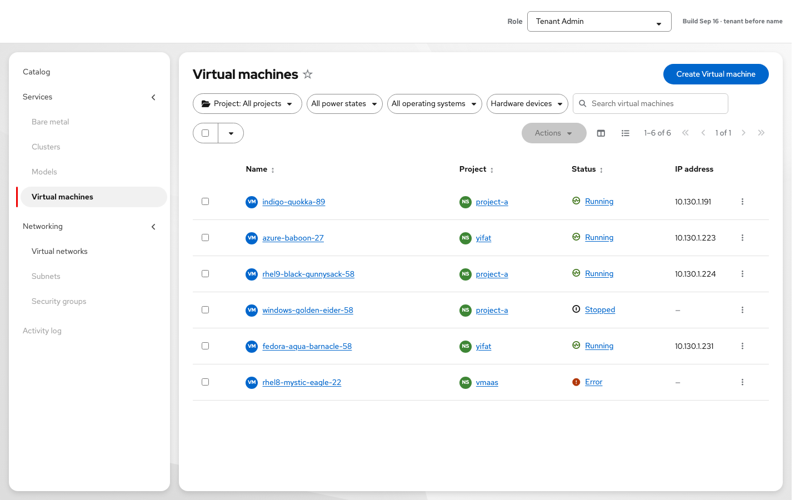

Figure: Virtual machines list

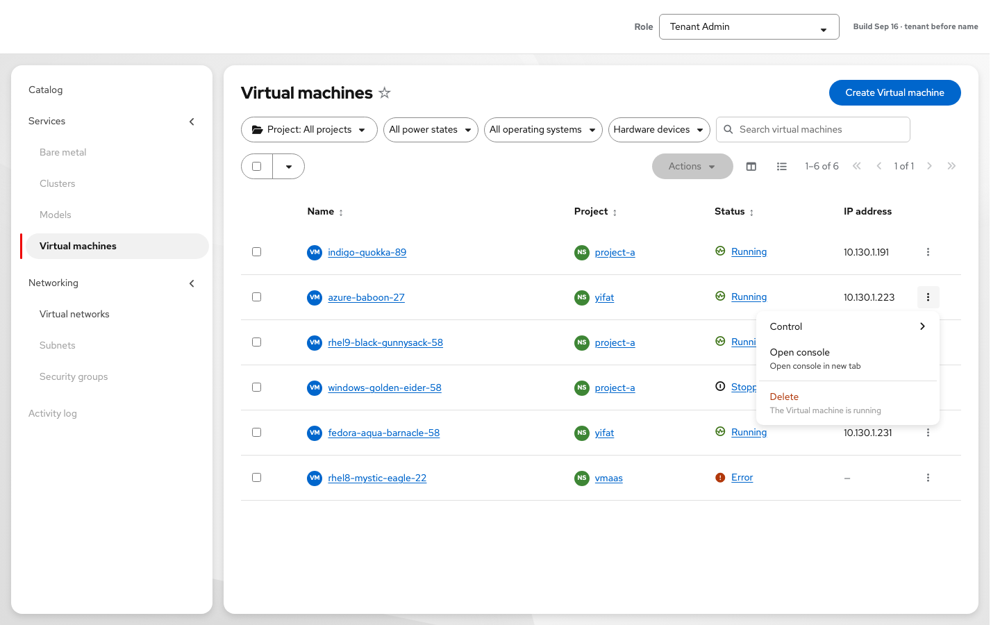

Figure: Row Actions kebab

---

## Create wizard

### Step 1 — Select template

- Project scopes available templates and creation target
- Selecting a template opens **Template settings** drawer (Locked / Editable governance)

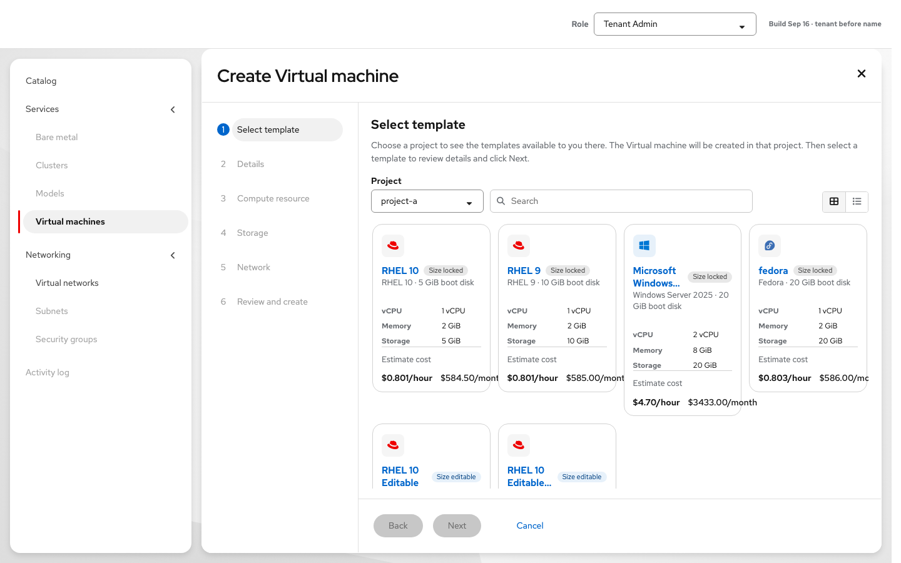

Figure: Select template

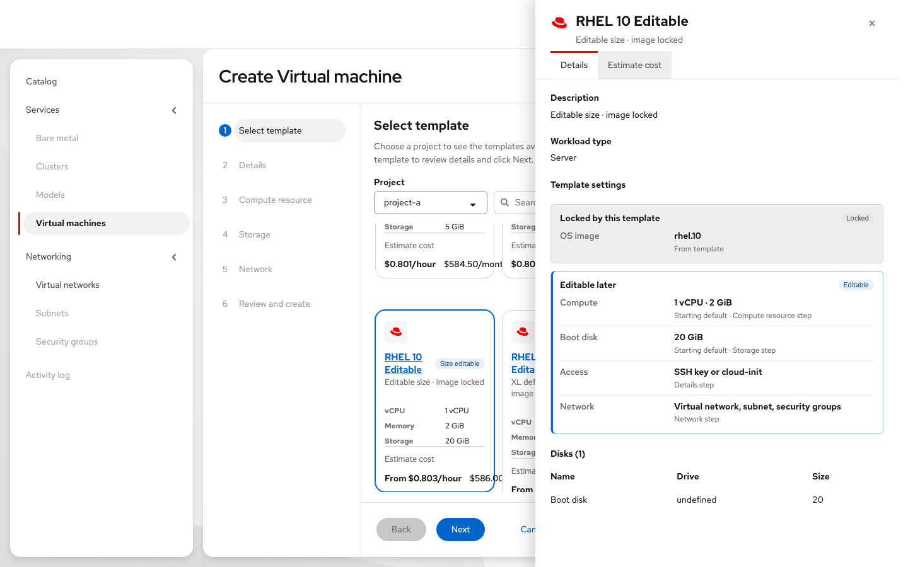

Figure: Template settings drawer

### Step 2 — Details

- Name (required) + generate; optional description
- Project shown as context (chosen on Select template)
- Optional Access: SSH public key / cloud-init

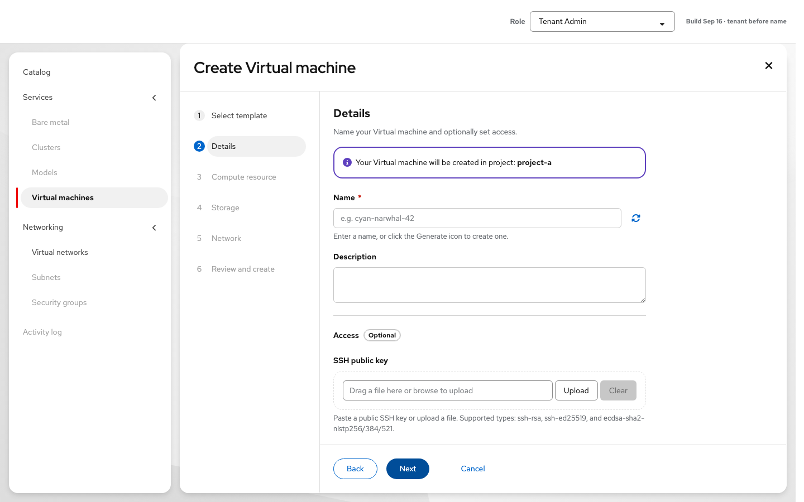

Figure: Details

### Step 3 — Compute resource

- Size locked or editable per template governance

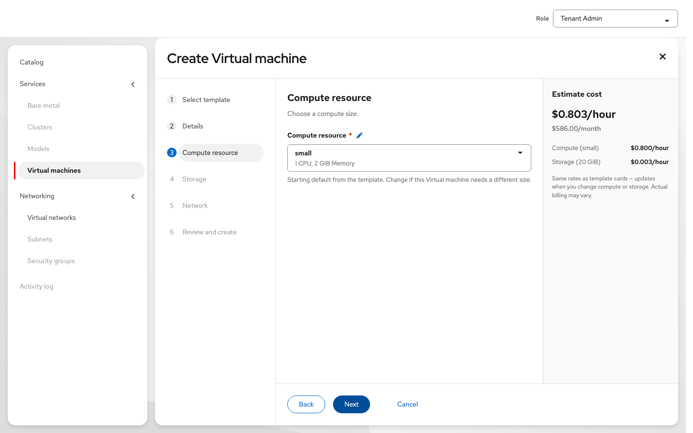

Figure: Compute resource

### Step 4 — Storage

- Boot disk size / storage tier
- Additional disks via inline **Add disk** sets (not a modal on this step)

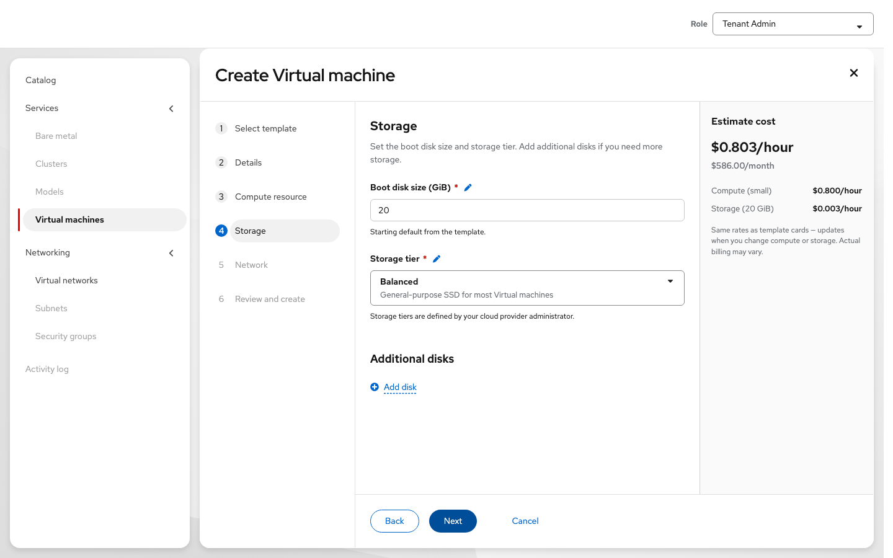

Figure: Storage

### Step 5 — Network

- Virtual network, subnet, security groups
- Additional networks via inline **Add network** sets

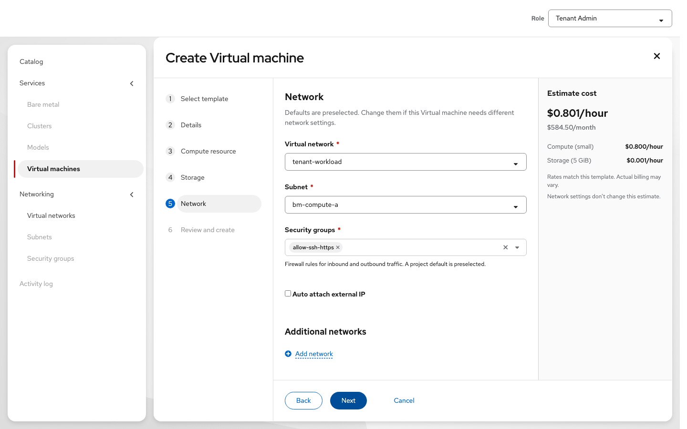

Figure: Network

### Step 6 — Review and create

- Grouped review with edit links; **Estimate cost** panel
- **Start this Virtual machine after creation** — checked by default

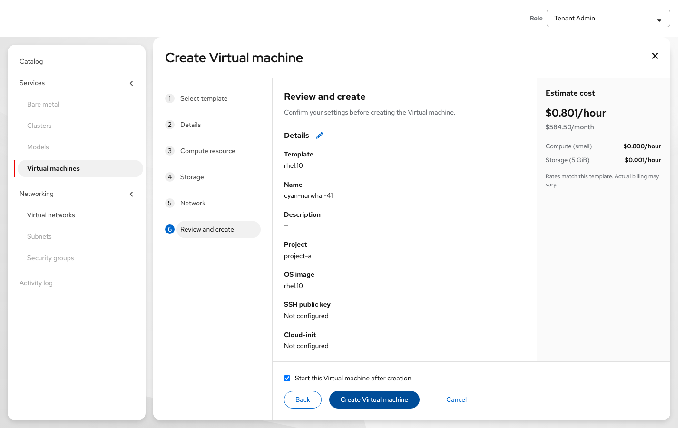

Figure: Review and create

### Exit confirmation

| Element | Copy |
|---|---|
| Title | Exit Virtual machine creation? |
| Body | If you leave now, any information you’ve entered won’t be saved. |
| Primary | Exit without saving |
| Secondary | Continue creating |

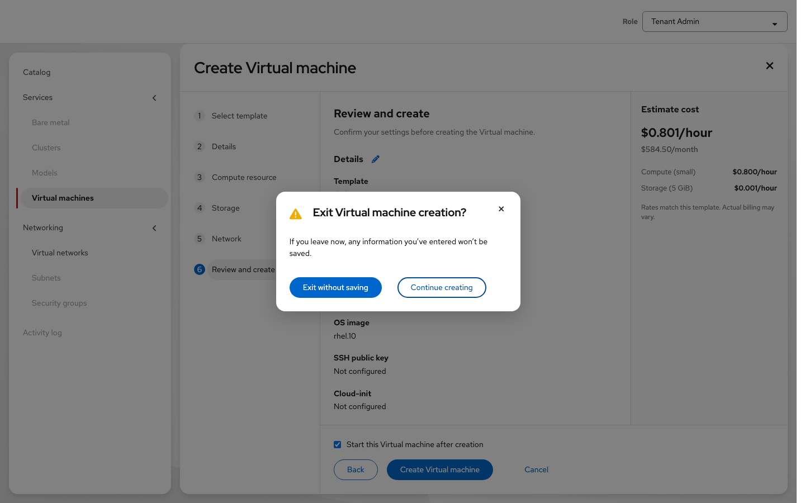

Figure: Exit confirmation

---

## VM Overview (day-2)

**Entry:** list Name link, after Create, or `?vm={name}`.

### Layout

| Column | Cards |
|---|---|
| **Main** | Details (incl. VNC) · Utilization |
| **Side** | Alerts · Network · Storage |
| **Full width** | Hardware devices · File systems |

### Details card (stacked fields)

| Column | Fields |
|---|---|
| **Overview** | Project · Status (link → popover) · Created |
| **Configuration** | Operating system · Compute resource (+ edit) · SSH public key (+ edit) |
| **VNC console** | Open web console + preview (same card, vertical divider) |

Header: breadcrumb · name + arch badge · status · power icons · Actions.

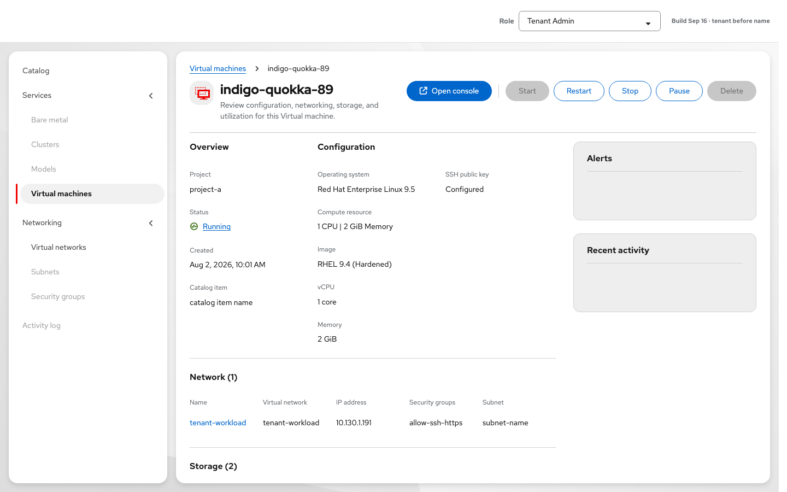

Figure: Overview — running

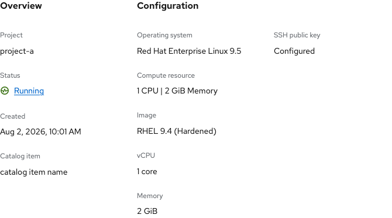

Figure: Details card — stacked Overview / Configuration + VNC

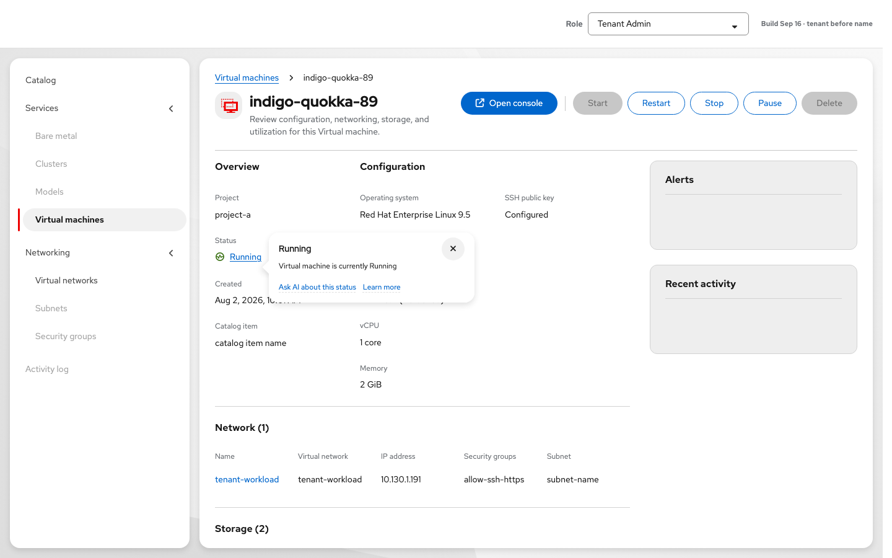

Figure: Status popover (Ask AI placeholder + Learn more)

**Network / Storage cards:** Add in header; row kebab Edit / Delete (disabled reasons for last network / boot disk).

**Utilization:** Metrics when Running; otherwise *Virtual machine is not running*.

---

# Part B — Infrastructure (Cloud provider admin)

Switch role to **Cloud provider admin**. Default landing: Instance types.

## Instance types — list

| Column | Notes |
|---|---|
| Name | Link → detail |
| Lifecycle state | Active / Deprecated / Obsolete badges |
| CPU cores · Memory (GiB) · GPUs · Created | |
| Actions | Kebab — lifecycle + Delete (danger) |

Primary CTA: **Create instance type**.

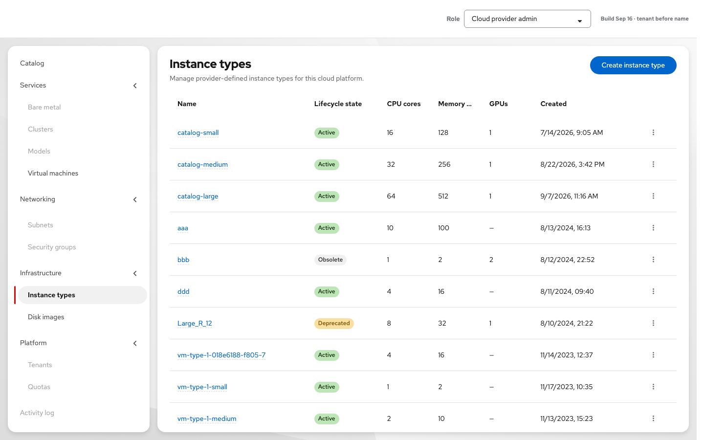

Figure: Instance types list

---

## Instance types — create

Breadcrumb: Instance types › Create.

| Field | Required | Notes |
|---|---|---|
| Name | Yes | DNS label (RFC 1035) helper |
| Description | No | |
| CPU cores | Yes | |
| Memory (GiB) | Yes | |
| GPU count / Resource name / PCI device selector | No | GPU section |

Actions: **Create** · **Cancel**.

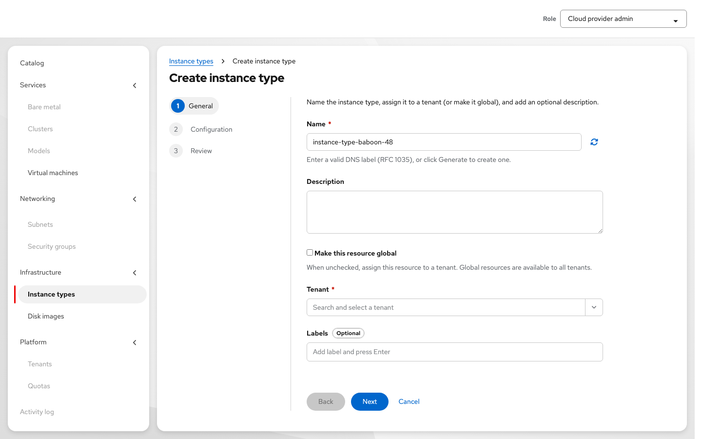

Figure: Create instance type

---

## Instance types — details

Single panel, three columns:

| Column | Fields |
|---|---|
| **Overview** | Lifecycle state · Name · Created |
| **Compute** | CPU cores · Memory (GiB) |
| **GPU** | Count · PCI device selector · Resource name |

Header: name + subtitle (`N CPU cores · M GiB`) · secondary **Actions** (Set Active / Deprecate / Mark Obsolete / Delete).

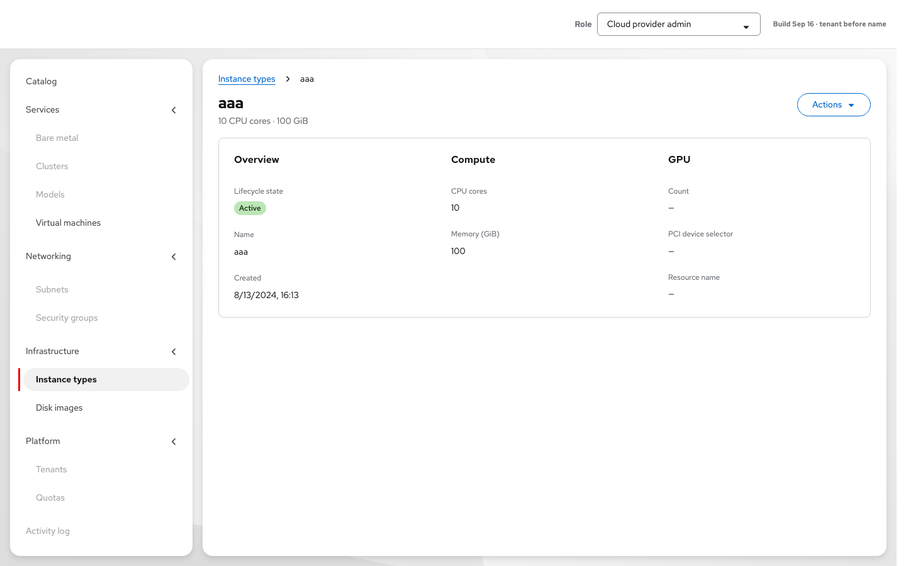

Figure: Instance type detail

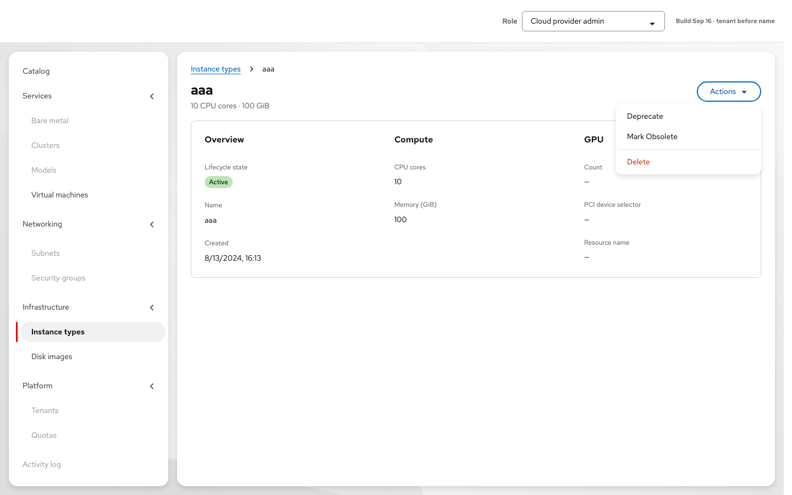

Figure: Instance type Actions menu

---

## Disk images — list

Aligned to [osac-ui PR 164](https://github.com/osac-project/osac-ui/pull/164).

| Column | Notes |
|---|---|
| Name | Link → detail |
| Lifecycle | Available / Deprecated / Obsolete |
| Guest OS family | Linux / Windows |
| Architecture | e.g. amd64, arm64 |
| Scope | Global or tenant name |
| Created | |
| Actions | Kebab — Deprecate / Obsolete / Reactivate; Delete when Obsolete |

Toolbar: **Show obsolete** (off by default — Obsolete rows hidden).

Primary CTA: **Create disk image**.

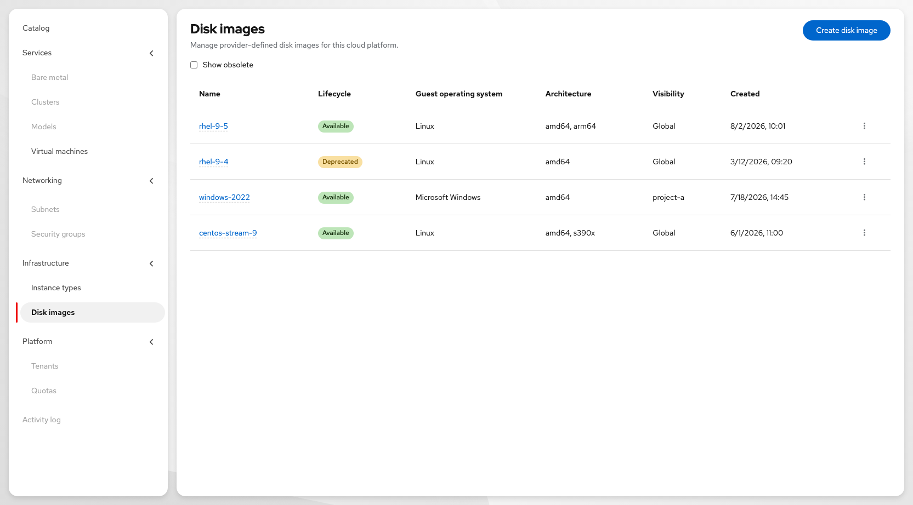

Figure: Disk images list

---

## Disk images — create

Aligned to product `DiskImageForm` + design screenshot.

Breadcrumb: Disk images › Create.

| Field | Required | Notes |
|---|---|---|
| Name | Yes | DNS label helper |
| Source type | — | Read-only **Registry** |
| Source reference | Yes | Registry ref |
| Guest OS family | Yes | Default Linux |
| Architecture | Yes | Multi-select (amd64 / arm64 / s390x); placeholder *Select options* |
| Scope | No | Default Global |

Actions: **Create** · **Cancel**. Success opens the new image’s detail page.

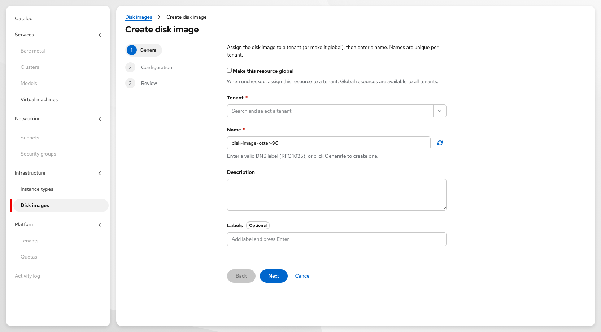

Figure: Create disk image

---

## Disk images — details

Aligned to [osac-ui PR 177](https://github.com/osac-project/osac-ui/pull/177).

Two columns:

| Column | Fields |
|---|---|
| **Overview** | Lifecycle · Scope · Created · Deprecation / Obsolescence timestamps (when set) |
| **Image** | Source type · Source reference · Guest OS family · Architecture |

Header: name + subtitle (`Guest OS · architecture`) · **Actions** when transitions are available.

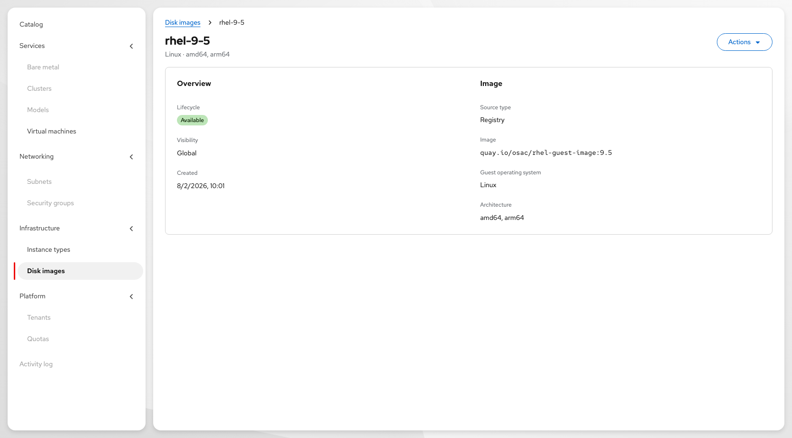

Figure: Disk image detail

### Lifecycle actions (Disk images)

| Current | Available actions |
|---|---|
| Available | Deprecate · Obsolete |
| Deprecated | Obsolete · Reactivate |
| Obsolete | Reactivate · Delete (danger) |

---

## Related

- Detailed Create-only write-up: `vmaas-create-vm-only-ux-doc.md`
- Detailed Overview write-up: `vmaas-vm-details-overview-ux-doc.md`
- Live mock: https://yfrimanm.github.io/openshift-origin-design/vmaas-ux-prototype.html?v=20260904-rename

---

## Appendix — Screenshot index

| File | Screen |
|---|---|
| `01-vm-list.png` | Virtual machines list |
| `01b-vm-kebab.png` | Row Actions kebab |
| `02-select-template.png` | Create — Select template |
| `03-template-drawer.png` | Template settings drawer |
| `04-details.png` | Create — Details |
| `05-compute.png` | Create — Compute resource |
| `06-storage.png` | Create — Storage |
| `07-network.png` | Create — Network |
| `08-review.png` | Create — Review and create |
| `09-exit-modal.png` | Exit confirmation |
| `10-vm-overview.png` | VM Overview |
| `10b-vm-details-card.png` | Details card (stacked fields) |
| `10c-status-popover.png` | Status popover |
| `11-instance-types-list.png` | Instance types list |
| `12-create-instance-type.png` | Create instance type |
| `13-instance-type-detail.png` | Instance type detail |
| `13b-instance-type-actions.png` | Instance type Actions |
| `14-disk-images-list.png` | Disk images list |
| `15-create-disk-image.png` | Create disk image |
| `16-disk-image-detail.png` | Disk image detail |
