# Virtual machine details Overview — UX documentation

### Contact: Yifat Friman Menchik, UXD

## Handoff overview

| | |
|---|---|
| **Scope of this doc** | Single-VM **details Overview** (day-2) |
| **Companion doc** | [Create Virtual machine — UX documentation](https://docs.google.com/document/d/1LL0iWhIIh3gAhJAsm7MCpnlFxfzaOXkZS_MVI6dSfSo/edit) |
| **Shared interactive mock** | [vmaas-create-vm-only.html](https://yfrimanm.github.io/openshift-origin-design/vmaas-create-vm-only.html) — list → create → details in one mock |
| **Google Doc** | [Virtual machine details Overview — UX documentation](https://docs.google.com/document/d/1Y8hjgE924owve0VXA3rkKqTYuB4sXKif8KhXyFL3hyQ/edit) |
| **Screenshots** | `videos/vmaas-vm-details-overview-ux-doc/` · [GitHub](https://github.com/yfrimanm/openshift-origin-design/tree/gh-pages/screenshots/details) |
| **Entry** | List **Name** link, or after Create finishes |

---

## Goal

Document OSAC VMaaS **Virtual machine details Overview**: CNV-inspired card layout with VMaaS terminology (Network, Storage tier, Virtual machine), without a separate Configuration nav in this mock.

---

## UX summary

| Decision | Detail |
|---|---|
| **Tabs** | Overview only in this mock (other detail tabs hidden). |
| **Breadcrumb** | Virtual machines › **{VM name}** |
| **Status** | In header and Details card — clickable → popover. **Ask AI about this status** is a placeholder until AI ships. |
| **Power icons** | Stop / Restart / Pause / Start — disabled states show **Virtual machine** tooltips (same reasons as Actions menu). |
| **Actions** | Control ▸, Open console, Delete — disabled copy uses **Virtual machine** / **Virtual machines**. |
| **Operating system** | Show OS from create/template metadata when known. If unknown: **—** + *Guest agent not reporting*. |
| **SSH** | *Configured* + pencil, or ***Not configured*** as a link (+ pencil) → edit modal. Windows: *Not applicable*. **Tenant User:** pencil / link disabled. |
| **Compute** | **Compute resource** + edit pencil. **Tenant User:** pencil disabled. |
| **Network / Storage** | Card **Add** + row kebab **Edit** / **Delete**. Delete disabled in-menu with reason (last network / boot disk). Terminology: **Network**. **Tenant User:** Add + row kebabs disabled. |
| **Utilization** | Metrics only when status is **Running**. Otherwise: *Virtual machine is not running*. Time range shown as static “Last 5 minutes”. |
| **After create** | Lands on this Overview with success toast. |
| **Roles** | Same shared mock shell: **Tenant Admin** (can edit Overview config) / **Tenant User** (read-only Overview config; power/console OK). Full matrix in Create doc. |
| **Shell chrome** | Same shared mock as Create: PatternFly **Felt + Glass** (PF 6.6.1), aligned to Ethan’s [osac-bmaas](https://heyethankim.github.io/osac-bmaas/) — soft floating sidebar/main panels. |

---

## Layout

| Column | Cards (top → bottom) |
|---|---|
| **Main (left)** | Details (incl. VNC) · Utilization |
| **Side (right)** | Alerts · Network · Storage |
| **Full width (bottom)** | Hardware devices · File systems |

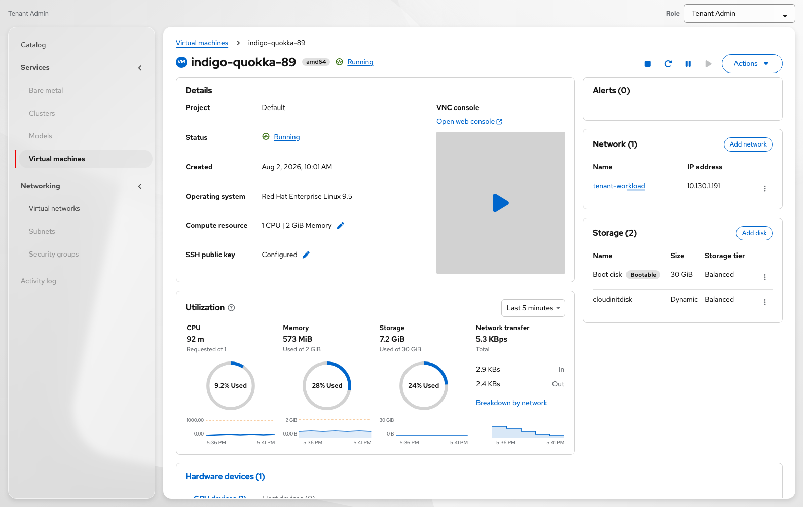

Figure: Overview — running

---

## Details card

| Field | Notes |
|---|---|
| **Project** | Display |
| **Status** | Link → popover (Ask AI placeholder + Learn more) |
| **Created** | Timestamp |
| **Operating system** | Metadata OS, or soft empty (*Guest agent not reporting*) |
| **Compute resource** | Summary + edit |
| **SSH public key** | Configured / Not configured (link) + pencil |
| **VNC console** | Open web console + preview. Opens full-page console (see **Web console** below). |

Name lives in the page header (not duplicated in the DL), with arch badge (**amd64**).

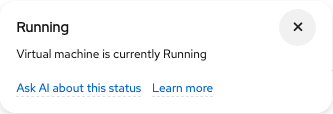

Figure: Status popover

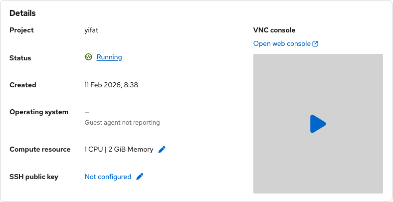

Figure: SSH Not configured

### Edit compute resources

Opens from the Compute resource pencil on the Details card.

| Element | Copy / behavior |
|---|---|
| Title | Edit compute resources |
| Description | Choose a compute size for this Virtual machine. |
| Field | **Compute resource** (required) |
| Actions | **Save** · **Cancel** |

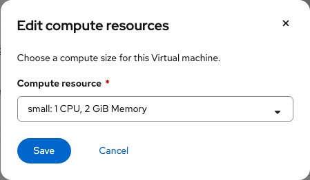

Figure: Edit compute resources

### Edit SSH public key

Opens from **Not configured** / pencil (Linux). Not used for Windows (*Not applicable*).

| Element | Copy / behavior |
|---|---|
| Title | Edit SSH public key |
| Description | Paste a public SSH key or upload a file for this Virtual machine. |
| Actions | **Save** · **Cancel** |

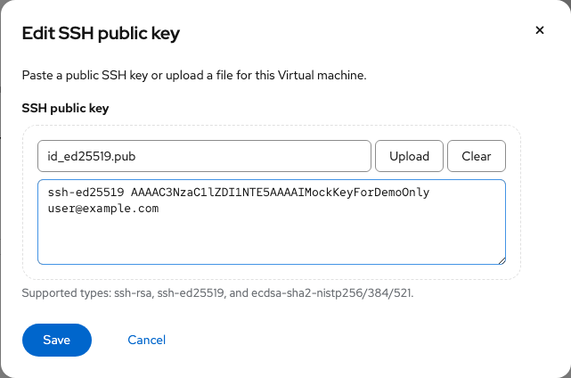

Figure: Edit SSH public key

---

## Web console

Full-page console placeholder (`vmaas-console-placeholder.html`), Felt + Glass chrome (soft floating toolbar / session panels; no hard toolbar divider).

| Area | Behavior |
|---|---|
| **Guest login credentials** | Username / password with show + copy. **?** opens a closable cloud-init popover (credentials created via cloud-init; contact image provider if unsuccessful). |
| **Paste to console** | Pastes clipboard into the session (placeholder toast). |
| **Console type** | **VNC console** / **Serial console** switcher (no language dropdown). |
| **Send key** | Ctrl+Alt+Del and special keys; **More key options** flyout for F1–F12. Disabled on **Serial console**. Tips sit to the **right** of icons (avoid top clipping). |
| **Disconnect** | Ends the session. |

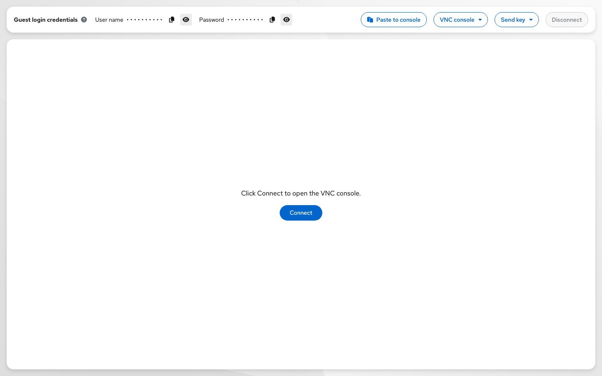

Figure: VNC console

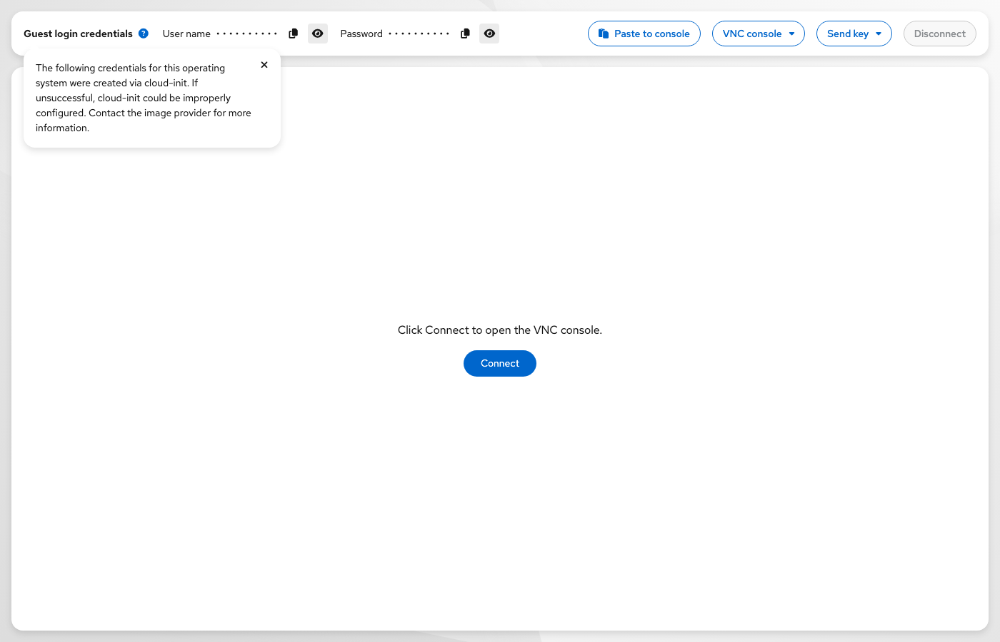

Figure: Guest credentials help (cloud-init)

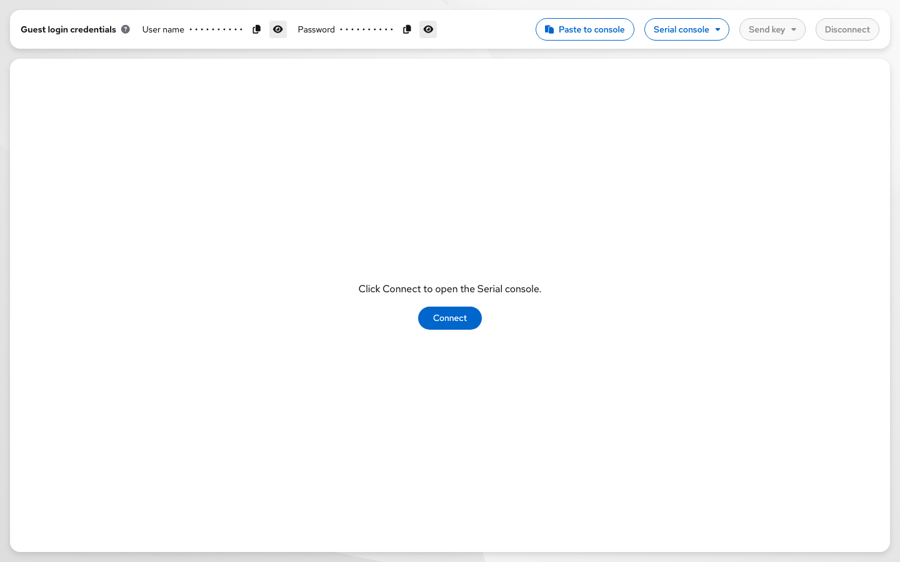

Figure: Serial console (Send key disabled)

---

## Network card

- Title: **Network (n)** + **Add network**
- Table: **Name** | **IP address** | actions
- Name opens network detail popover
- Row kebab: **Edit** (opens Add network modal in edit mode) · **Delete**
- Last network: Delete disabled — *At least one network is required.*
- Success toasts: *Network “…” added / updated / Deleted network …*

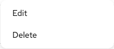

Figure: Network row actions

### Add / Edit network modal

Same modal; title switches **Add network** ↔ **Edit network**. Fields: Virtual network, Subnet, Security groups (required). Footer: **Save** / **Add** · **Cancel**.

Figure: Add network

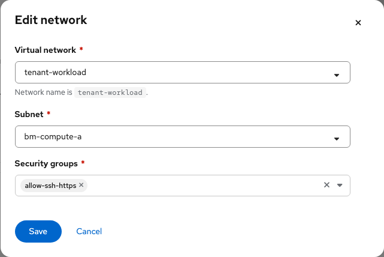

Figure: Edit network

### Delete network confirmation

| Element | Copy |
|---|---|
| Title | Delete network? |
| Body | Are you sure you want to delete **{name}**? This action cannot be undone. |
| Actions | **Delete** (danger) · **Cancel** |

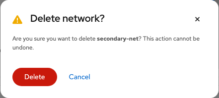

Figure: Delete network

---

## Storage card

- Title: **Storage (n)** + **Add disk**
- Table: **Name** | **Size** | **Storage tier** | actions
- Bootable badge on boot disk
- Row kebab: **Edit** · **Delete**
- Boot disk: Delete disabled — *The boot disk cannot be deleted.*

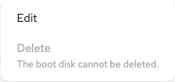

Figure: Boot disk Delete disabled

### Add / Edit disk modal

Same modal; title switches **Add disk** ↔ **Edit disk**. Fields include size and storage tier (and name as applicable). Footer: **Save** / **Add** · **Cancel**.

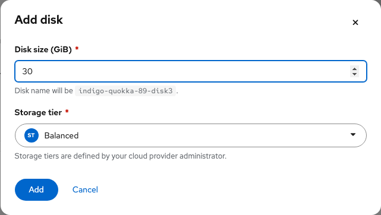

Figure: Add disk

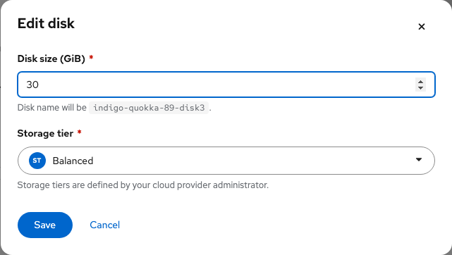

Figure: Edit disk

---

## Utilization card

- When **Running**: CPU · Memory · Storage · Network transfer tiles
- When not running: centered empty state — *Virtual machine is not running*
- Help icon on title; time range is non-interactive in the mock

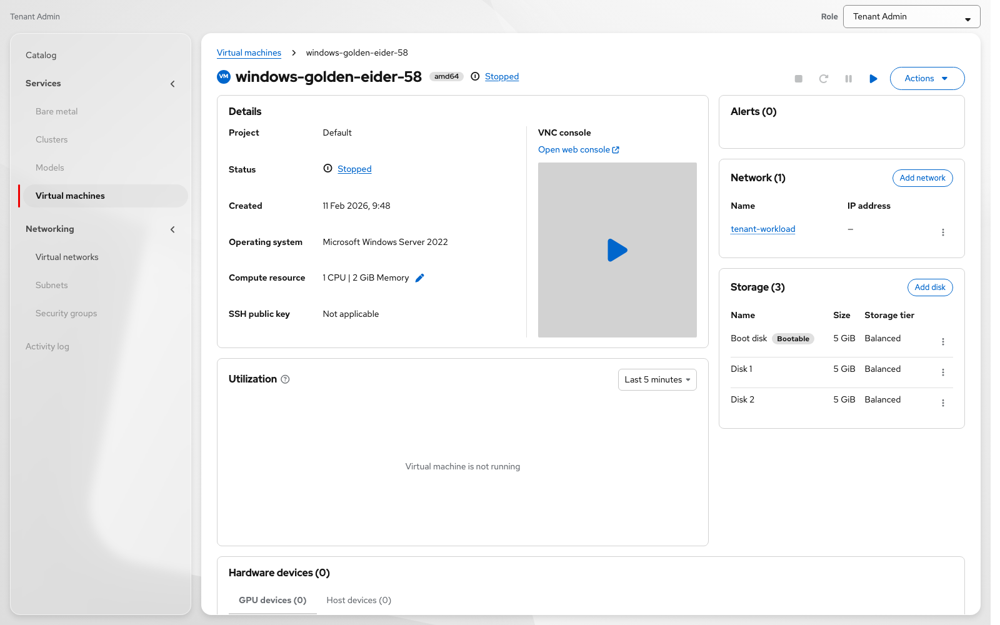

Figure: Utilization when not running

---

## Alerts / Hardware / File systems

- **Alerts** — count + list when present (Diagnostics deep-link not wired)
- **Hardware devices** — GPU / Host tabs; empty states
- **File systems** — guest FS table + help

---

## Header power + Actions

| Control | Enabled when |
|---|---|
| **Stop** | Running or Paused |
| **Restart** | Running |
| **Pause** | Running |
| **Start** | Not running and not starting |
| **Actions** | Control ▸ · Open console · Delete |

Disabled icon tooltips match Actions menu reasons (*The Virtual machine is starting / not running / running*).

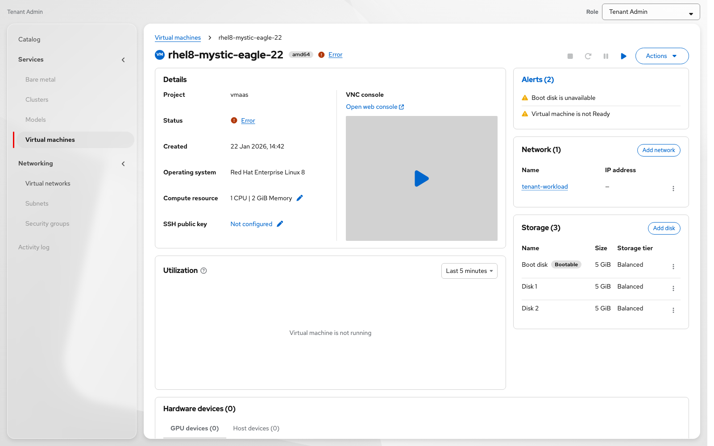

Figure: Error status

### Delete Virtual machine

From Actions → **Delete** when the VM is not running.

| Element | Copy |
|---|---|
| Title | Delete Virtual machine? |
| Body | Are you sure you want to delete **{VM name}**? This action cannot be undone. |
| Actions | **Delete** (danger) · **Cancel** |

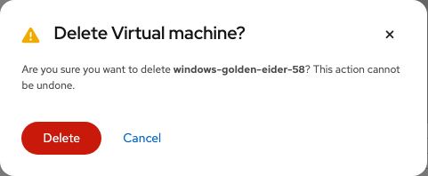

Figure: Delete Virtual machine

---

## Related

- **Create UX doc** — list + wizard handoff
- **Mock (shared):** https://yfrimanm.github.io/openshift-origin-design/vmaas-create-vm-only.html
